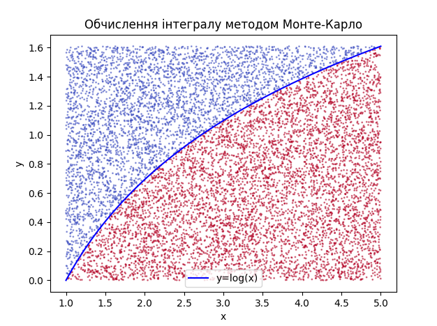

### task02 ###

#### Обчислювання інтеграла методом МонтеКарло ####

Оцінка знаходження інтеграла методом Монте-Карло за великої кількості точок майже точно збігається з аналітичними розрахунками.

Оцінка інтеграла методом Монте-Карло: 4.04999

Оцінка інтеграла аналітичним методом: 4.047189562170502

Точність результату: 9.12814162236787e-11